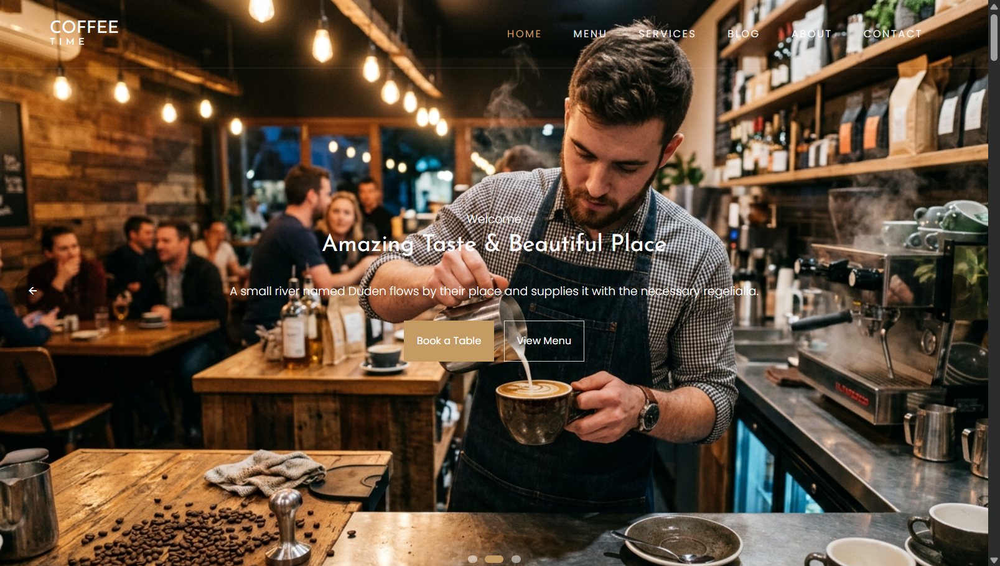

# COFFEE TIME — Artisan Coffeehouse & Dining Experience



Live link: [Coffee Time](https://saif-coffee-time.netlify.app)

A modern coffeehouse and restaurant web experience designed for a refined café brand serving premium brews, seasonal dishes, artisan desserts, and warm hospitality. Built with React 19, TypeScript, and Vite for a fast, elegant, and fully responsive customer experience.

---

## 🌟 Overview & Philosophy

**Coffee Time** brings together modern café culture with elevated dining experience, offering guests a polished digital storefront for discovering handcrafted drinks, signature plates, and the atmosphere of a premium neighborhood coffee bar.

### Core Experience Principles
- **Warm, Premium Visual Identity**: Rich coffee tones, soft lighting, and elegant typography that reflect artisanal quality.
- **Smooth Storytelling Experience**: Carefully structured sections guiding visitors from brand story to menu, services, and reservations.
- **Responsive, Conversion-Focused Layouts**: Built for browsing on desktop and mobile with clear paths to explore food, drinks, and table booking.
- **Motion-Driven Interactions**: Subtle transitions and animated cards powered by Motion for a polished modern feel.

---

## 🚀 Key Features & Modules

### 1. Hero Experience & Brand Story
- Full-width hero slider highlighting curated café moments, signature coffee, and a welcoming ambiance.
- Strong brand positioning with calls to action for menu exploration and reservations.
- Clean headline hierarchy designed for conversions and visual clarity.

### 2. Signature Menu & Product Showcase
- Featured beverage, dessert, and dining items presented in a polished, high-contrast catalog.
- Product cards with pricing, descriptive details, and image-based presentation.
- Category-focused menu previews for coffees, mains, desserts, and drinks.

### 3. Dining Services & Experience Highlights
- Dedicated service section showcasing specialty coffee, fresh brews, and quality ingredients.
- Visual blocks communicating the café’s value proposition, hospitality, and craftsmanship.

### 4. Reservation & Booking Flow
- Interactive booking form for reserving a table directly from the home page.
- User-friendly input flow with validation support for guest details and contact information.
- Success feedback after submitting booking information.

### 5. Testimonials & Social Proof
- Customer review carousel highlighting positive guest experiences.
- Testimonials add trust and reinforce the café’s atmosphere and quality.

### 6. Blog, About, and Contact Experience
- Informational pages covering the café story, food culture, and service philosophy.
- Dedicated blog layout for articles, updates, and brand storytelling.
- Contact section for inquiries, service details, and visit information.

---

## 🛠️ Tech Stack & Architecture

| Technology | Purpose |
| :--- | :--- |
| **React 19** | Component-based UI and interactivity |
| **TypeScript** | Strong typing and safer front-end development |
| **Vite** | Fast local development and optimized production builds |
| **React Router** | Page routing across home, menu, blog, services, and contact views |
| **Motion** | Smooth transitions, hover effects, and animated UI |
| **CSS / Custom Styling** | Full cafe branding, responsive layouts, and premium visual polish |

---

## 📁 Directory Structure

```text
├── public/
│   ├── css/                    # Styling assets and theme stylesheet
│   ├── fonts/                 # Icon and typography font files
│   └── images/                # Café photography and design assets
├── src/
│   ├── components/            # Reusable UI components
│   │   ├── BackToTop.tsx
│   │   ├── BookTableSection.tsx
│   │   ├── CounterSection.tsx
│   │   ├── Footer.tsx
│   │   ├── GallerySection.tsx
│   │   ├── HeroSlider.tsx
│   │   ├── Navbar.tsx
│   │   ├── ScrollAnimation.tsx
│   │   ├── ScrollProgress.tsx
│   │   ├── ScrollToTop.tsx
│   │   └── TestimoniesSlider.tsx
│   ├── data/
│   │   └── mockData.ts        # Structured menu, product, blog, and review data
│   ├── pages/
│   │   ├── About.tsx
│   │   ├── Blog.tsx
│   │   ├── BlogSingle.tsx
│   │   ├── Contact.tsx
│   │   ├── Home.tsx
│   │   ├── Menu.tsx
│   │   └── Services.tsx
│   ├── App.tsx               # Routing and top-level layout
│   ├── main.tsx              # Application entry point
│   ├── types.ts              # Shared TypeScript interfaces
│   └── vite-env.d.ts         # Vite TypeScript environment declarations
├── index.html                # App entry HTML file
├── metadata.json             # Project metadata and summary info
├── package.json              # Scripts and dependencies
├── tsconfig.json             # TypeScript configuration
├── vite.config.ts           # Vite configuration
├── README.md                # Project documentation
└── public/images/Coffee_Time_1.png
```

---

## 💻 Getting Started & Local Development

### Prerequisites
- **Node.js**: `v18.0.0` or higher
- **npm** package manager

### Installation

1. **Clone or open the repository**:
   ```bash
   git clone <repository-url>
   cd coffee_time
   ```

2. **Install dependencies**:
   ```bash
   npm install
   ```

3. **Start the development server**:
   ```bash
   npm run dev
   ```
   The application will run locally at `http://localhost:3000`.

### Available Scripts

- `npm run dev` — Starts the Vite development server on port 3000.
- `npm run build` — Produces a production-ready build in the `dist/` folder.
- `npm run lint` — Runs TypeScript checking without emitting files.

---

## 📱 Responsive Design & Accessibility

- **Mobile-first layout** for browsing and booking across devices.
- **Fluid spacing and typography** for consistent presentation on larger screens.
- **Accessible input flows** with clear labeling and validation feedback.
- **Performance-conscious UI** with optimized transitions and lightweight content structure.

---

## 📄 License & Credits

Built for **Coffee Time**. All rights reserved.
